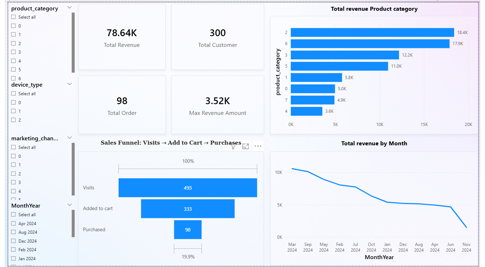
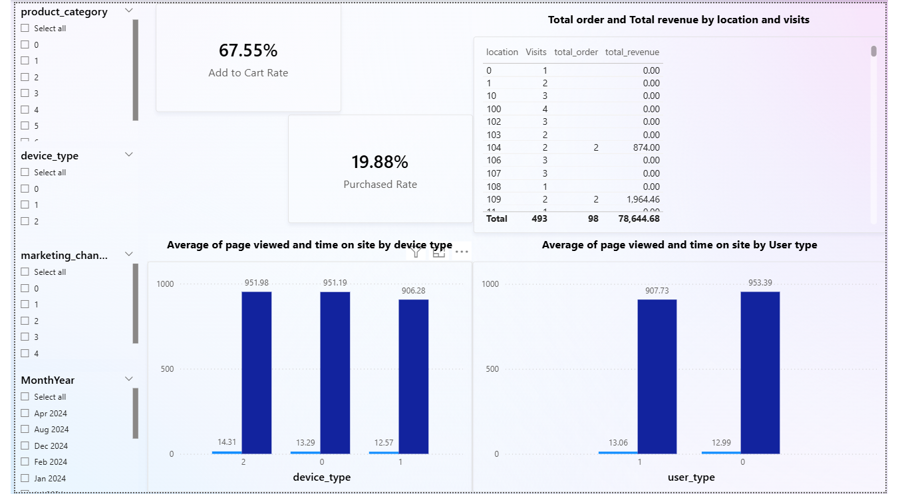
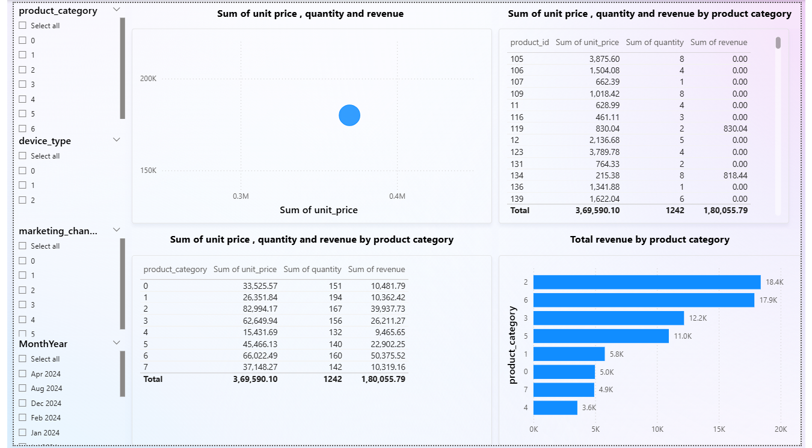
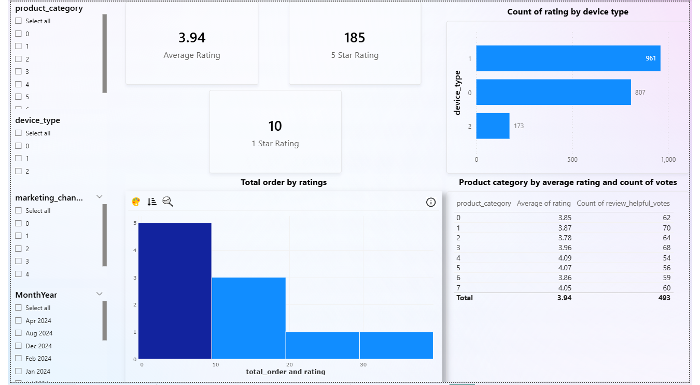

# 🚀 E-commerce Sales Analytics Dashboard

**SQL + Power BI analysis of 10K+ customer sessions**: Revenue trends, conversion funnel, customer ratings analysis.

## 📊 Dashboard Preview
| Executive Overview | Customer Behaviour | Product Performance | Reviews Satisfaction |
|--------------------|-------------------|-------------------|---------------------|
|  |  |  |  |

## 🔧 Tech Stack
- **SQL**: 3 queries + 2 views (revenue trends, funnel metrics, category analysis)
- **Power BI**: 15+ DAX measures (Funnel_Value, Total_Revenue, Max_Revenue_Date)
- **Slicers**: MonthYear, Location, Device_Type, Marketing Channel
- **Data**: 10K+ e-commerce sessions (visits → purchases → ratings)

##
